---

# Esquema

 * Objetivo
 * The task
 * Algunas peculiaridades, \small{sobre N<<p}
 * Experimentación
 
    - Instancias 
    - EDA
    - Implementación y  __Determinación del número de componentes__ 
    
 * Resultados
 * Conclusiones
 * Trabajos Futuros
 * Anexo: Extensiones
 * Bibliografía
  
# Objetivo

 **Confrontar la elección del número de factores a considerar, para la tarea de predicción que requieren algunos métodos de reducción de dimensión**.

# The task

Evaluamos el desempeño de regresión por componentes principales (PCR) y la regresión por mínimos cuadrados parciales (PLS).

Muchas técnicas \footnote{MDS o la regresión por componentes supervisada,... }  requieren de precisar el número de componentes a utilizar, lo cual involucra un criterio de selección. 

#

Comparamos 3 métodos: El criterio de Kaiser \cite{kaiser} (criticado en sus aspectos teóricos y muestrales en \cite{horn}), el Parallel Analysis y proponemos uno basado en la teoría de RMT.

El Parallel Analysis conlleva simular matrices de correlación de una función de distribución multivariada desconocida por lo que es imperativo una implementación eficiente.

 

# Algunas peculiaridades, \small{sobre N<<p}

No ejemplo: 

En configuraciones HDLSS un resultado asintótico establece que si $p\rightarrow \infty$ y mantenemos $N$ fija entonces la muestra puede ser pensada como un politopo con $N$ puntos \cite{hdlss}, después de algunos escalamientos convenientes.

El resultado anterior se extiende a cuando el vector aleatorio $X$ constituye una serie de tiempo no necesariamente estacionaria.

# El experimento

Se definieron tres instancias, todas con las mismas dimensiones y con la misma partición para entrenamiento y prueba.

* La primera consiste en 90 variables con distribución $N(0,\sigma_i)$.

* La segunda con 90 variables con distribución $Rayleigh(\sigma_i)$. 

* La tercera es uno de los datasets de \textit{Million Song Dataset} la cual consiste en datos y metadatos de más de un millón de canciones que tiene entre uno de sus fines alentar la investigación en algoritmos a escalas comerciales (por lo cual lo encontramos de interés). Lanzadas en [1978,2011]

# EDA

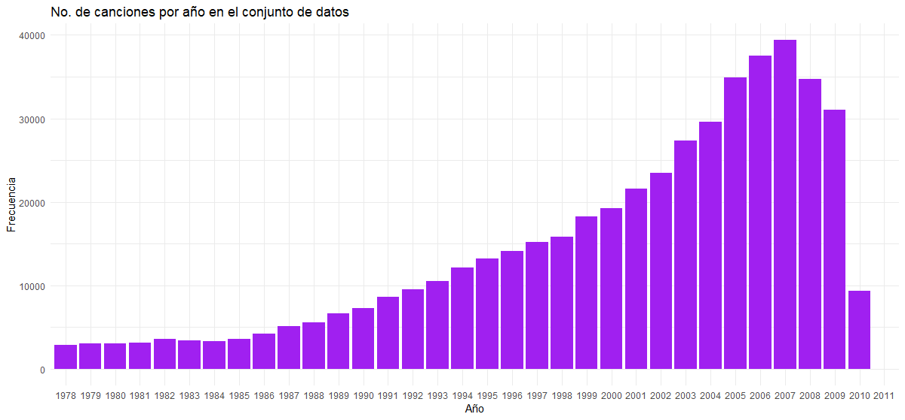

# PCA

# Linealidad ?

# Implementación

  * Kaiser: Eigendescomposición
  * Parallel analysis:
  
    - Muestreo apriori
    - Bootstrap
  
  * M-K: Simulación y promedio $O(n)$

La implementación es conceptualmente fácil de paralelizar, en una arquitectura multihilo. Los cálculos fueron efectuados en una instancia Standard F8s\_v2 (8 vcpu, 32 GB de memoria) del servicio Azure.

#Instancia 1 500 simulaciones

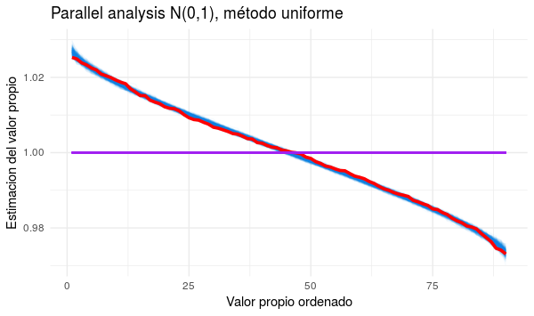

#

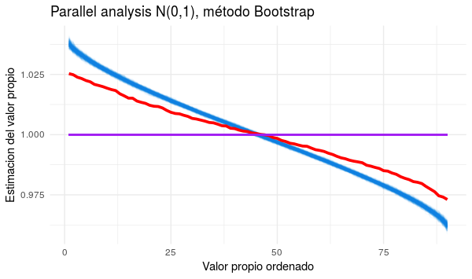

#

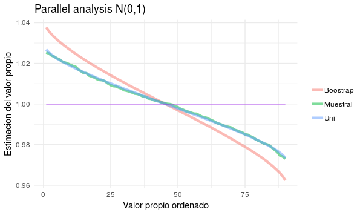

# 

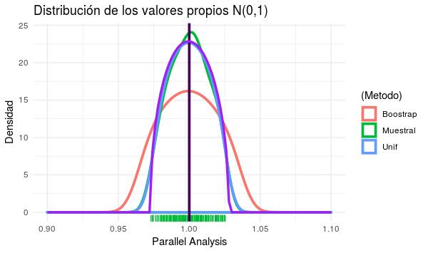

#

Los resultados en esta instancia son los esperados: el criterios de Kaiser, el parallel analysis uniforme y con bootstrap sugieren el mismo número de componentes (el punto en donde las curvas se intersectan).\footnote{ El criterio 'del codo' ?}

# Instancia 2 (Rayleigh)

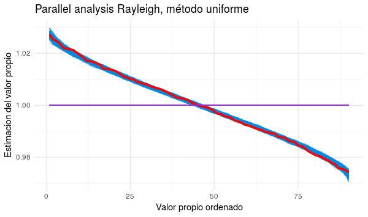

#

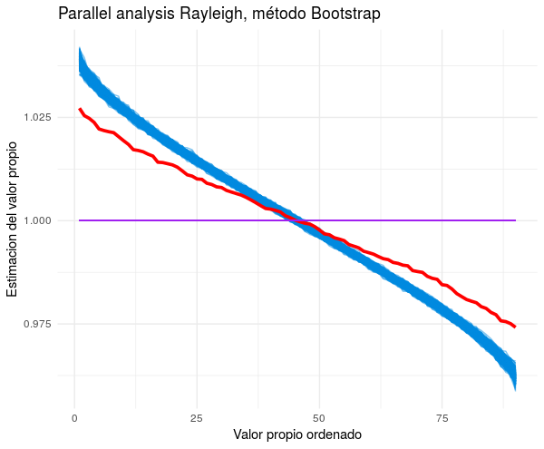

#

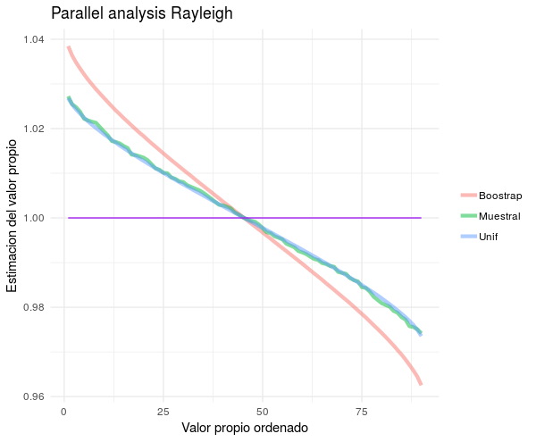

#

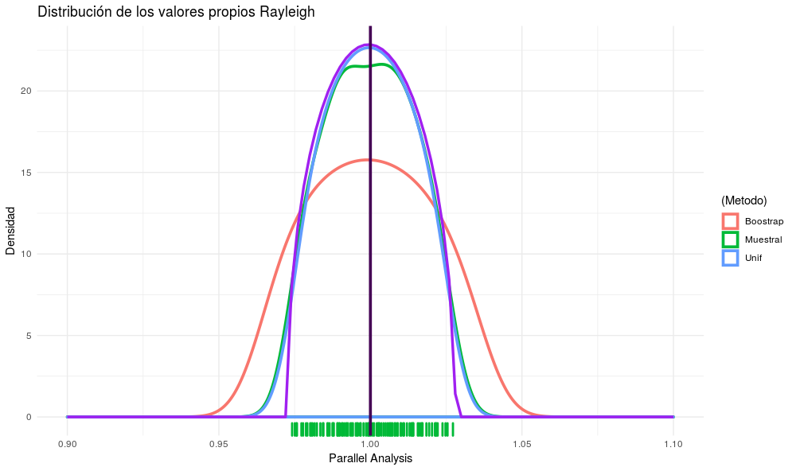

# 

Esta instancia presentó los mismos resultados que la anterior (45 componentes). La distribución límite de Marchenko Pastur encierra a todos los valores propios.
\footnote{Este experimento nos sugiere que el criterio que estamos tomando usando  resultados de matrices aleatorias podría extenderse, sino a todas las distribuciones tal vez sí a las de la familia exponencial.}

# Caso práctico

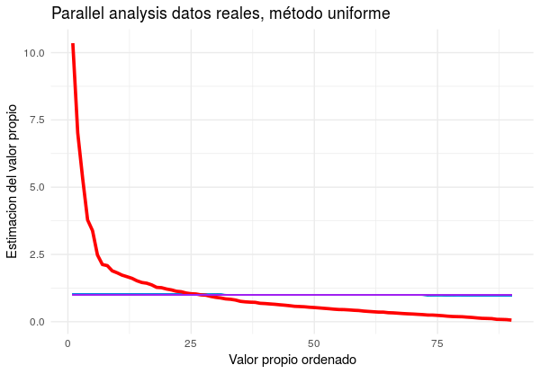

#

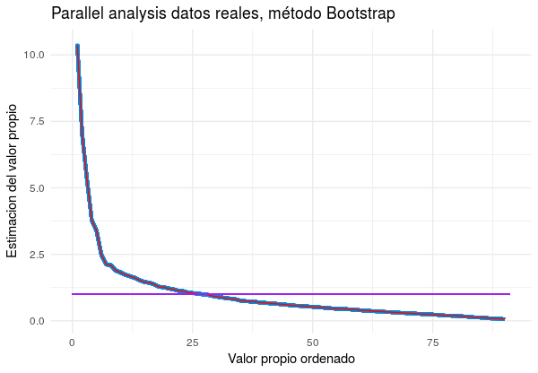

#

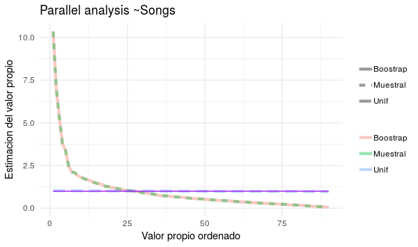

# Instancia 3(Million Song Dataset)

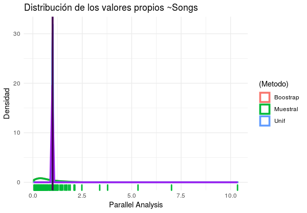

#

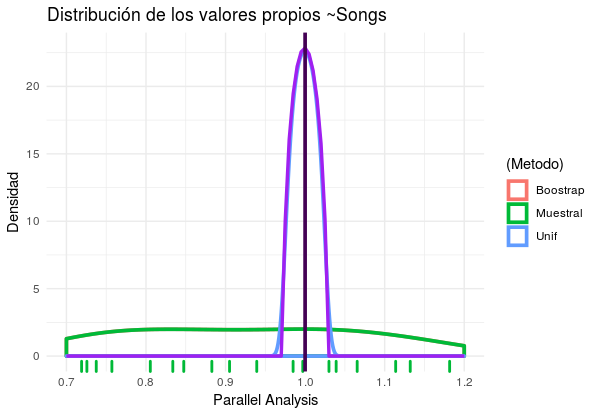

#

En la siguiente tabla resumimos los números de componentes que propone cada criterio sobre las tres instancias, así como sus respectivos tiempos de cómputo que requiere la simulación:

\begin{center}
\begin{tabular}{|l|c|c|c|c|c|}
\hline
Id  & Kaiser &  Uniforme & Bootstrap & M-P & Tiempo\\
\hline
1 & 45 & 45 &  45 & 46 &  12.2mins + 36.54 mins \\
2 & 45  &45& 45&  45 & 13.54 mins + 44.25 mins\\
3 & 25 & 31  & 37 & 27 & 13.02 mins + 50.41 mins  \\
\hline
\end{tabular}
\end{center}

# Predicción

\textbf{En un trabajo del donador de los datos \cite{paper} se reporta un error sobre el conjunto de prueba de 10.20 y 8.76 (medido en la misma escala que en nuestro experimento) utilizando el método de 50 vecinos más cercanos y el algoritmo de Vowpal Wabbit.} Nuestro resultado final es de \textbf{9.5}. casi en el punto medio sin embargo nosotros nos restringimos a métodos de regresión lineales.

# Conclusiones

Nuestro criterio basado en la distribución de Marchenko Pastur:
 
  - Ahorra de recursos para la elección del número de componentes frente a cv en PCR.
  
  - Acota el espacio de búsqueda de las componentes de PLS.

 
 Diseñamos un experimento para simulación donde se tienen tres estratos el primero muy cercano a los supuestos necesarios del teorema de Marchenko-Pastur\footnote{Cuyo paper original se encuentra en ruso \includegraphics[height=5.0mm]{carita_miedo.PNG}}, el segundo no satisfaciendo la normalidad y el tercero (datos reales) solo con media cero y desviación estándar estimada igual a la unidad.
 

- La estimación utilizando técnicas de reducción de dimensionalidad, en particular PLS con una proporción bastante pequeña respecto al número de variables siempre presentó un mejor desempeño aún en casos teóricos y prácticos.

#

- La agregación puede aportar grandes ganancias por encima de los componentes individuales.

- Citando a Stephen M. Stigler \footnote{ver \cite{ame} pág. 23} sobre el cuento de Jorge Luis Borges \textit{Funes el memorioso} de 1942

\begin{center}
\textit{  \large\textbf{{Funes era big data sin estadística}}}
\end{center}

# Trabajos Futuros

Extender el criterio definido en este trabajo 

- Implementación en paralelo del 'test' (en una arquitectura GPU) \footnote{Horn a finales de su trabajo \cite{horn} sugiere implementar un método en el software estadístico (pues al día de hoy desconocemos una implementación popular)}

- Utilizar el test en conjuntos de datos con alta correlación donde esperamos mejores resultados aunque esto requiere de una adaptación de PLS.

- Probar su utilidad y robustez en modelos de cointegración y factores dinamicos en series de tiempo.  

# Anexo

Hemos encontrado que nuestro criterio se desempeña mejor en la regresión PCR y PLS al pronosticar el indice SP500 que no requiere de estacionalidad y estacionariedad en los datos. Sin embargo el número de componentes del criterio es __dependiente__ de realizar las transformaciones sobre las series de tiempo mencionadas. 

En \cite{copia} se desarrolla un nuevo criterio de selección de componentes 'Empirical Kaiser Criterion' cuya metodología es ligeramente diferente a la desarrollada. 
 

#

\begin{thebibliography}{1}

\bibitem{copia}
Braeken, J., y van Assen, M. A. L. M. \textit{An empirical Kaiser criterion}. Psychological Methods, 22(3), 450-466. http://dx.doi.org/10.1037/met0000074, 2017.

\bibitem{actanumericachafa}
A. Edelman; \textit{Random Matrix Theory and its Innovative Applications};2013.

\bibitem{horn}
Horn, J. L.; \textit{A Rationale and Test For the Number of Factors in Factor Analysis}; Psychometrika, 30, 179-85; 1965.

\bibitem{kaggle}
Kaggle Inc.; \url{https://www.kaggle.com/} consultado el 23 de octubre de 2018

\bibitem{kaiser}
Kaisert H.; \textit{The application of electronic computers to factor analysis}; Paper read at
a symposium on application of computers to psychological problems. Meeting of Amer. Psychol. Ass., 1959. 

\end{thebibliography}

#

\begin{thebibliography}{1}

\bibitem{hdlss}
Peter Hall, J. S. Marron and Amnon Neeman; \textit{Geometric Representation of High Dimension, Low Sample Size Data}; Journal of the Royal Statistical Society. Series B (Statistical Methodology); Vol. 67; No. 3 (2005), pp. 427-444.

\bibitem{elements}
Hastie T., Tibshirani R. and Friedman J. ; \textit{The 
Elements of Statistical Larning}; Springer 2nd., 2009.

\bibitem{ame}
Stephen M. Stigler; \textit{Los siete pilares de la sabiduría estadística}; Libros Grano de Sal, 1er edición 2017.

\bibitem{paper}
T. Bertin-Mahieux, D. P.W. Ellis,B. Whitman y P. Lamere ; \textit{THE MILLION SONG DATASET}; recuperado de \url{https://www.ee.columbia.edu/~dpwe/pubs/BertEWL11-msd.pdf} el 3 de noviembre de 2018.\\

\bibitem{Another}
Wang, B. and Zou, H. (2017) \emph{Another Look at Distance Weighted Discrimination}, Journal of Royal Statistical Society, Series B, 80(1), 177-198. \url{https://rss.onlinelibrary.wiley.com/doi/10.1111/rssb.12244}

\end{thebibliography}