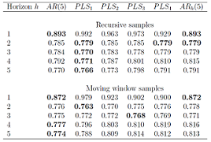

---

# Esquema

 * Antecedentes y definición del problema
 * Justificación y objetivos
 * Metodología (Qué se tiene)
 * Cronograma  (Cómo vamos)
 * Anexo: Extensiones
 * Bibliografía
  
# Antecedentes, $PLSAR(h,p)$, y definición del problema

Phillip Hans Franses\footnote{2006, Países Bajos }  propone una metodología para __realizar pronosticos a $h$ horizontes, de manera conjunta.__

El método se ilustra con la productividad de USA en $[1945.1, 2000.4]$ comparándolo contra $AR(p)$ y $AR_j(p)$

# Antecedentes, lo cool:

\begin{itemize}

    \item CI (Bootstrap)    \faThumbsOUp
    
    \item Test formales para $rank(\hat{B}_{pls})$ \faTicket
    
    \item  Extension a $k>1$ y no estacionaridad \faThumbsOUp
    
\end{itemize}

# Justificación y objetivos

OLS minimiza MSE para $\epsilon_t$ \footnote{Dentro de la muestra. Ver \cite{Lutkepohl}} pero no garantiza que lo sea para $h$ errores a futuro
 
__Pronósticos precisos y confiables, para la toma de decisiones__

Costo computacional bajo (implementación eficiente)

# Metodología

\begin{itemize}

\item Modelo VAR

\item Con el proceso autorregresivo construir la regresión PLS (pronóstico)

\item	Construcción de intervalos de predicción vía Bootstrap

\end{itemize}

# Metodología (Qué se tiene)

\begin{itemize}

\item Fundamentos teóricos: ts, VAR, PLS.  

\item Comparación con otra metodología (resultados de la estancia de vinculación) \footnote{Diferente a la usada por Frances, incluye inflación y tipo de cambio}

\end{itemize}

# Metodología (lo nuevo)

\begin{itemize}

\item Contexto del uso de modelos VAR en econometría \footnote{A partir de la revisión de \cite{Juselius}}    

\end{itemize}

# Cronograma (Cómo vamos)

# Anexo: Posibles extensiones

\begin{itemize}
    \item Incluir cointegración PLS-VAR
    \item Matrices \textit{sparse}
\end{itemize}

# Bibliografía

\begin{thebibliography}{1}

\bibitem{Juselius}
Juselius, K. (2007).The Cointegrated VAR Model: Methodology and Applications.  Ad-vanced Texts in Econometrics. Oxford University Press, USA, 2 edition. 

\bibitem{Haavelmo}
Haavelmo,  T.  (1944).The  probability  approch  in  econometrrics.Econometrica,12(Supplement):1-118.  12, 

\bibitem{PLSmaths}
Hoskuldsson (1988); \textit{ PLS Regression Methods}, Journal of Chemometrics, Vol 2, pp 221-228

\bibitem{Lutkepohl}
Lutkepohl, H. (2006).New  Introduction  To  Multiple  Time  Series  Analysis.  Springer.

\bibitem{frances}
Philip Hans Franses (2006); \textit{Forecasting 1 to h steps ahead using partial least squares}, Econometric Institute, Erasmus University Rotterdam, Econometric Institute Report
2006-47

\bibitem{interpretation}
P.H. Garthwaite (1994); \textit{An Interpretation of Partial Least Squares},  JASA Vol 89, No 425, pp122-127

\end{thebibliography}

# 

\begin{thebibliography}{1}

\bibitem{1} 
Brockwell, P. J. and Davis, R. A. (1986).\textit{Time Series: Theory and Methods.} Springer-Verlag, Berlin, Heidelberg.  

\bibitem{2}
Chan, N. H. (2010). \textit{Time Series: Applications to Finance with R and S-Plus(R)}. WileySeries in probability and Statistics. Wiley, 2nd edition.  

\bibitem{3}
Hamilton, J. D. (1994). \textit{Time Series Analysis}. Princeton University Press, 1 edition. 7
\end{thebibliography}

