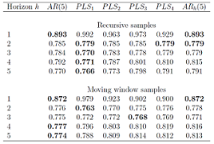

---

# Esquema

\begin{itemize}
\item Antecedentes y justificación
 \item Metodología  (Qué se tiene)
 
     \begin{itemize}
    
     \item  Introducción (80\%)
     \item  Fundamentos teoricos (75\%)
     \item  Metodología VAR-PLS (20\%)
     \item Resultados (10\%)
     \item Conclusiones (0\%)
     \end{itemize}
 
 \item Cronograma  (Issues)
 
      \begin{itemize}
    
     \item  Introducción (20\%)
     \item  Fundamentos teoricos (25\%)
     \item  Metodología VAR-PLS (80\%)
     \item Resultados (90\%)
     \item Conclusiones (100\%)
     \end{itemize}
 
 \item Anexo: Extensiones
 \item Bibliografía

\end{itemize}
  
# Antecedentes, $PLSAR(h,p)$

[Phillip Hans Franses](http://www.erim.eur.nl/people/philip-hans-franses/)   propone una metodología para __realizar pronosticos a $h$ horizontes, de manera conjunta.__

El [MÉTODO](https://www.google.com/url?sa=i&source=images&cd=&ved=2ahUKEwi5jo_rhfzhAhUSNn0KHSawChoQjRx6BAgBEAU&url=https%3A%2F%2Fbooks.google.com%2Fbooks%2Fabout%2FPeriodic_Time_Series_Models.html%3Fid%3DbhTUcMf0xUUC%26source%3Dkp_cover&psig=AOvVaw3Tdm2WiDO2i85bRQukF8Et&ust=1556858992025720) se ilustra con la productividad de USA en $[1945.1;2000.4]$ comparándolo contra $AR(p)$ y $AR_j(p)$

 

# Antecedentes y justificación

\textbf{Pronósticos precisos y confiables, para la toma de decisiones}

\begin{itemize}

    \item CI (Bootstrap)    \faThumbsOUp
    
    \item Test formales para $rank(\hat{B}_{pls})$ \faTicket\footnote{Nota para Andrés} \[ X = kW ,  Y = kBC \rightarrow Y = X(W^{-1}BC)\]
    
    \item  Extension a $k>1$ y no estacionaridad \faThumbsOUp
     
     \item \small{OLS minimiza MSE para $\epsilon_t$ errores dentro de muestra pero no para $h$ obsevaciones a futuro}
     
     \item \small{Costo computacional bajo (implementación eficiente)}
    
\end{itemize}

# Metodología

\begin{itemize}

\item Modelo VAR

\item Con el proceso autorregresivo construir la regresión PLS (pronóstico)

\item	Construcción de intervalos de predicción vía Bootstrap

\end{itemize}

# Metodología (lo nuevo)

\begin{itemize}

\item Contexto del uso de modelos VAR en econometría \footnote{A partir de la revisión de \cite{Juselius}}    
 

\end{itemize}

# Cronograma (Issues)

Se ha buscado que sea un documento autocontenido \footnote{En medida de lo posible}:

\begin{itemize}
    
\item  Introducción (20\%). Requiere de que se te termine el proyecto para citar las conclusiones. 

\item  Fundamentos teoricos (25\%). Solo requiere de escribir y acotar, las secciones de Bootstrap y de Monte Carlo.

\end{itemize}

# Cronograma (ISSUES)

\begin{itemize}

\item  Metodología VAR-PLS (80\%). Exclusivamente se requiere documentar y comprender una función que realiza la estimación de los intervalos de confianza, con ello se continúa escribiendo la metodología y se continua con los resultados al comparar con otros métodos.

\item Resultados (90\%). Falta la implementación de un Monte Carlo para validar la metodología y una aplicación empírica con variables mexicanas.
  
\item Conclusiones (100\%)
     
\end{itemize}
 

# Cronograma

# Anexo: Posibles extensiones

\begin{itemize}
    \item Incluir cointegración PLS-VAR
    \item Matrices \textit{sparse}
\end{itemize}

# Bibliografía

\begin{thebibliography}{1}

\bibitem{Bootstrap}
Pascual, Ruiz y Fresoli (2011). Bootstrap forecast of multivariate VAR models
without using the backward representation. Working Paper 11-34,  Statistics and
Econometrics Series

\bibitem{Juselius}
Juselius, K. (2007).The Cointegrated VAR Model: Methodology and Applications.  Ad-vanced Texts in Econometrics. Oxford University Press, USA, 2 edition. 

\bibitem{Haavelmo}
Haavelmo,  T.  (1944).The  probability  approch  in  econometrrics.Econometrica,12(Supplement):1-118.  12, 

\bibitem{PLSmaths}
Hoskuldsson (1988); \textit{ PLS Regression Methods}, Journal of Chemometrics, Vol 2, pp 221-228

\bibitem{frances}
Philip Hans Franses (2006); \textit{Forecasting 1 to h steps ahead using partial least squares}, Econometric Institute, Erasmus University Rotterdam, Econometric Institute Report
2006-47

\end{thebibliography}

# 

\begin{thebibliography}{1}

\bibitem{Lutkepohl}
Lutkepohl, H. (2006).New  Introduction  To  Multiple  Time  Series  Analysis.  Springer.

\bibitem{1} 
Brockwell, P. J. and Davis, R. A. (1986).\textit{Time Series: Theory and Methods.} Springer-Verlag, Berlin, Heidelberg.  

\bibitem{2}
Chan, N. H. (2010). \textit{Time Series: Applications to Finance with R and S-Plus(R)}. WileySeries in probability and Statistics. Wiley, 2nd edition.  

\bibitem{3}
Hamilton, J. D. (1994). \textit{Time Series Analysis}. Princeton University Press, 1 edition. 7
\end{thebibliography}

