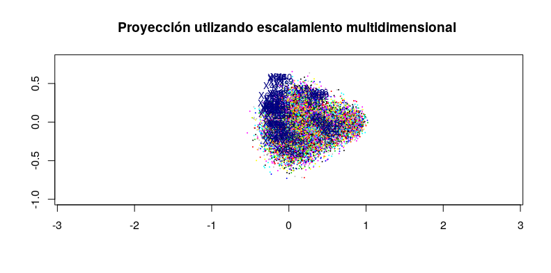
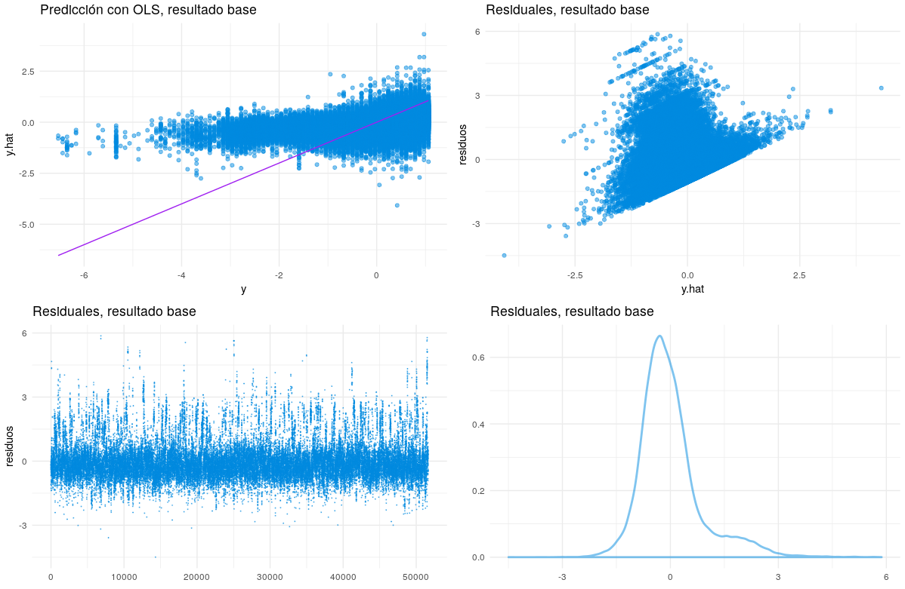

---

# Esquema

 * Objetivo
 * Conjunto de datos
 * EDA
 * Resultado base:
    - Paper
    - Kaggle
 * Resultados:
    - Regresión OLS y técnicas de contracción 
    - Regresión con reducción de dimensión 
    - Extra: regresión no lineal
 * Conclusiones
 
 * Anexo: Parallel analysis 
    

# Objetivo

* __Predecir el año de lanzamiento de una canción a partir de las características del audio, utilizando PLS Y PCR.__

* Producto secundario: contraste entre métodos basados en OLS, contracción, reducción de dimensionalidad y no lineales para realizar regresión en dimensiones *medianas*.

# Conjunto de datos 

* Canciones comerciales cuyo año de lanzamiento se encuentra en $[1922,2011]$

* Subconjunto del famoso __Million Song Dataset__\footnote{Uno de sus fines es alentar la investigación en algoritmos a escalas comerciales} (515,345 observaciones con 90 variables y etiqueta).

* Partición: 463,715 observaciones para el conjunto de entrenamiento, cerca del 89\% de la muestra, y el resto 51,630 como conjunto de prueba.\footnote{Sugerencia del donador de los datos}

# Conjunto de datos, comentario

A pesar de no encontrarnos en una configuración HDLSS \footnote{Hall, P., Marron,
J. S. and Neeman, A. (2005) Geometric representation of high
dimension low sample size data} sí tenemos un problema de muestreo respecto a la dimensionalidad.

# Resultado base

* En un trabajo del donador de los datos\footnote{T. Bertin-Mahieux, D. P.W. Ellis,B. Whitman y P. Lamere; \textit{THE MILLION SONG DATASET}} se reporta un error sobre el conjunto de prueba de 10.20 y 8.76 (medido como RMSE con las variables en su escala original) utilizando el método de 50 vecinos más cercanos y el algoritmo de Vowpal Wabbit.

* En la web [Kaggle](https://www.kaggle.com/c/ml210-release-year/leaderboard) se reportan errrores de 8.86\footnote{No existe evidencia del método utilizado y de si se utilizó el conjunto de datos completo}

# EDA, distribucón de $y$

# EDA, MDS stress-1 inferior a 0.3

# EDA ¿Linealidad?

# Resultados, OLS y técnicas de contracción 

\begin{center}
\begin{tabular}{|l|c|c|c|c|}
\hline
Método  & MSE entrenamiento & MSE prueba & Folds & Tiempo\\
\hline
OLS & 0.7637302 & 0.7569239  & 2&  2 segs \\
OLS, step & 0.7637379  &0.7569413 &2&  1.11 hrs \\
Ridge & 1.001594 &   0.9856738  & 500* & 26.26 mins \\
Lasso & 1.001594 &  0.9856738 & 2500* & 30.49 mins \\
\hline
\end{tabular}
\end{center}

La regularización se vuelve demasiado fuerte, por lo que las variables importantes pueden quedar fuera del modelo y los coeficientes se reducen excesivamente $\approx 1e{-08}$

#  Resultados: OLS estimación 

# Resultados, técnicas de reducción de dimensionalidad

\begin{center}
\begin{tabular}{|l|c|c|c|c|}
\hline
Método  & MSE entrenamiento & MSE prueba & Folds & Tiempo\\
\hline
PCR & 0.8710691 &  0.8627718  & 50 &  20.18 mins\\
PLS &  0.7637633 &  0.7568457 & 120* & 20.34 mins \\
\hline
\end{tabular}
\end{center}

# Resultados, regresión no lineal

Se realizó una búsqueda exhaustiva sobre diferentes grids utilizando SVM, KNN y el algoritmo de XGBoost. 

\begin{center}
\begin{tabular}{|l|c|c|c|}
\hline
Variables de entrada, &                   &            &       \\ \hline 
XGBoost               & MSE entrenamiento & MSE prueba & Tiempo\\ \hline
40 PC & 0.7166808 &  0.8281409 & 3.15 hrs\\
16 PLS &  0.7637633 &  0.7099578 & 20.34 mins \\
90 variables originales &  1.3547 & 1.25721 & 7.25 hrs \\ 
\hline
\end{tabular}
\end{center}

# Resultados 

Usando la RMSE y la misma escala que el donador de los datos el error de PLS es de 9.509669, y usando los scores de PLS como entradas para XGB el error es de 9.210389

 * Conclusiones

* Podríamos considerar que existen 12 variables latentes sin embargo encontramos una mejor predicción al estimar 16 componentes de PLS.

* En el espacio oblicuo de los scores de PLS, XBG muestra una ganancia marginal en comparación de los tiempos de cómputo que requiere. 

# Cierre

\begin{center}
\textit{La agregación puede aportar grandes ganancias por encima de los componentes individuales. Funes era big data sin estadística} \footnote{Stephen M. Stigler; \textit{Los siete pilares de la sabiduría estadística}; Libros Grano de Sal, 1er edición 2017, pág. 23}
\end{center}

  

# Anexo: Parallel analysis 

  * Enfoque de PCR usando Parallel analysis: Imperativo una simulación eficaz y eficiente.
  - Bootstrap y distribución apriori no informativa.
  

# Anexo: Parallel analysis (simulaciones montecarlo ~5000)

  

  
