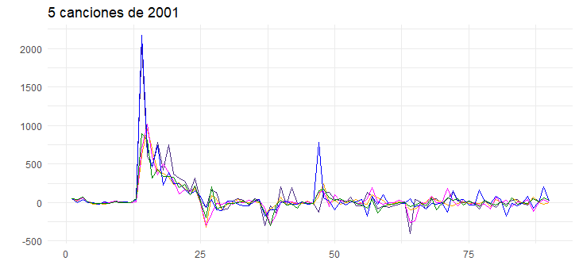
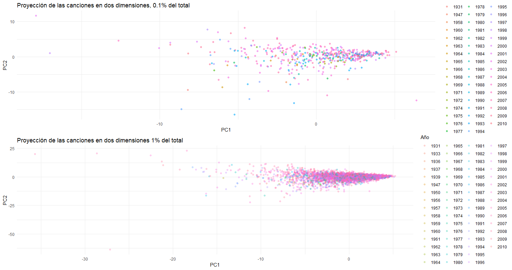
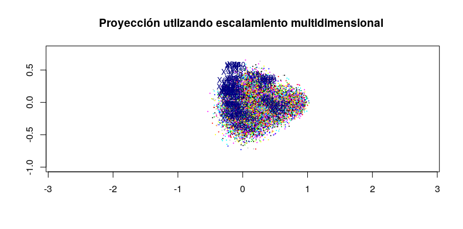
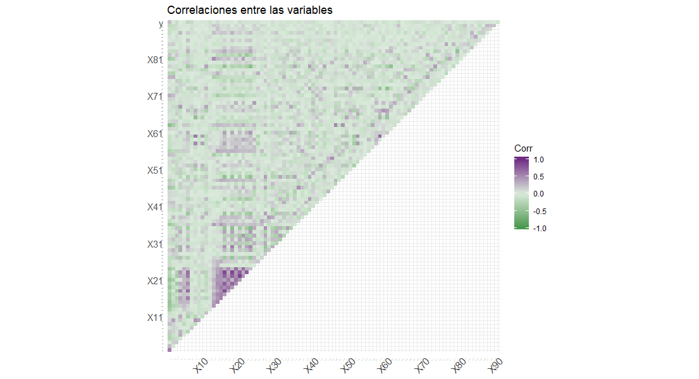

---

# Esquema

 * Objetivo
 * Conjunto de datos
 * Situación actual:
    1.  EDA (visualización, PCA, MDS unfolding)
    2.  Regresión ¿ __lineal__ ? 
    3.  Hechos
    
 * Pendientes
    
    

# Objetivo

* __Predecir__ el año de lanzamiento de una canción a partir de las características del audio, utilizando PLS Y PCR.

# Conjunto de datos 

* Canciones comerciales que varían en su año de lanzamiento entre 1922 y 2011

* Subconjunto del famoso __Million Song Dataset__ 
* 515,345 observaciones con 90 variables y etiqueta

# 

# 

# Situación actual 

- Dataset limpio, no requirió de técnicas de imputación 
- Resultados sin muestreo, usando todo el dataset

# Situación actual

* Se determinó si estamos en una situación del tipo *maldición de la dimensionalidad*

* Aunque $N>p$ no tenemos datos chaparros (HDLSS)  \footnote{High Dimension
Low Sample Size (HDLSS): Hall, P., Marron, J. S. and Neeman, A. (2005) Geometric representation of high dimension low sample size data} sí tenemos problemas de muestreo pues $500,000$ observaciones en un espacio 90-dimensional corresponde a aprox. 2 en un espacio unidimensional \footnote{pág. 22 TESL, 1er ed.} 

# EDA PCA

# EDA MDS 

# EDA ¿ Linealidad ?

# Hechos

Resultado base, predicción con:

  * Un modelo apropiado de *OLS* y cv
    
    - OLS, sobre nuestra partición, errores de (90.44, 91.25, segundos)
    - OLS-step (90.24, 91.25, 1.125 hrs, 81 $x_i$
    - OLS-subset (en ejecucion)

Comparación de resultados (Restricción a partición):

* Con una competencia en [Kaggle](https://www.kaggle.com/c/ml210-release-year/leaderboard)

* Utilizando MSE
  
# Pendientes

  * Un modelo estimado con *Ridge* y cv
  * Un modelo estimado con *Lasso* y cv
  * PCR y cv
  * PLS y cv

  

# Posibles anexos:

  * Enfoque de PCR usando Parallel analysis: Imperativo una simulación eficaz
  
  * Clusterización de observaciones: ¿Correspondencia entre años? (hecho)
  
# Cereza

  * PLS como *supervised principal components*

